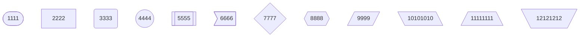
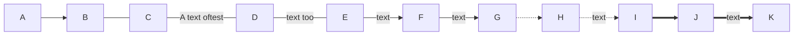
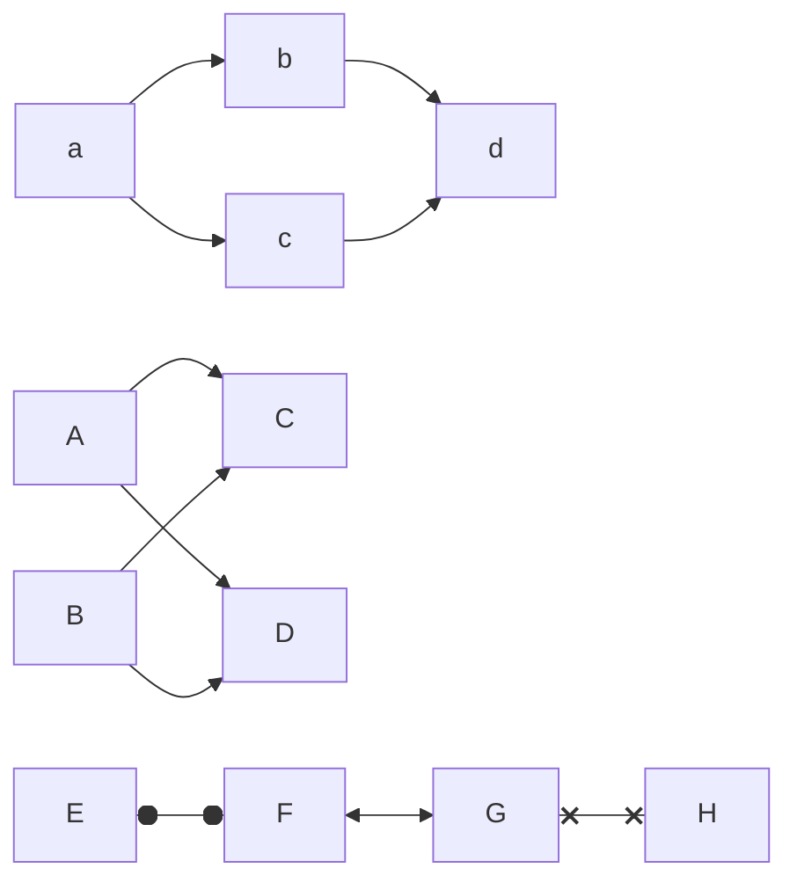
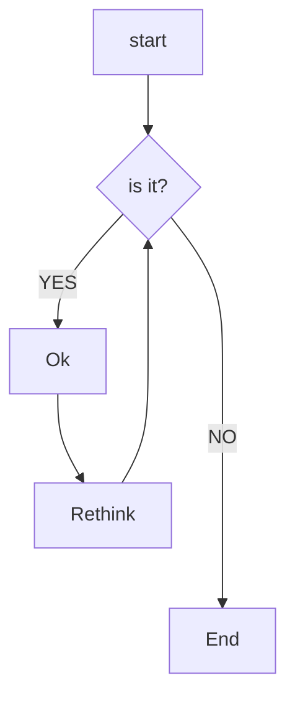
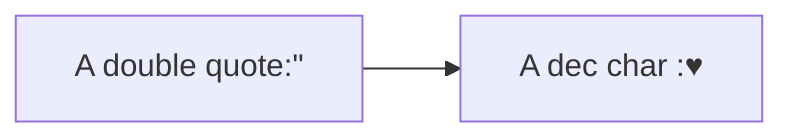
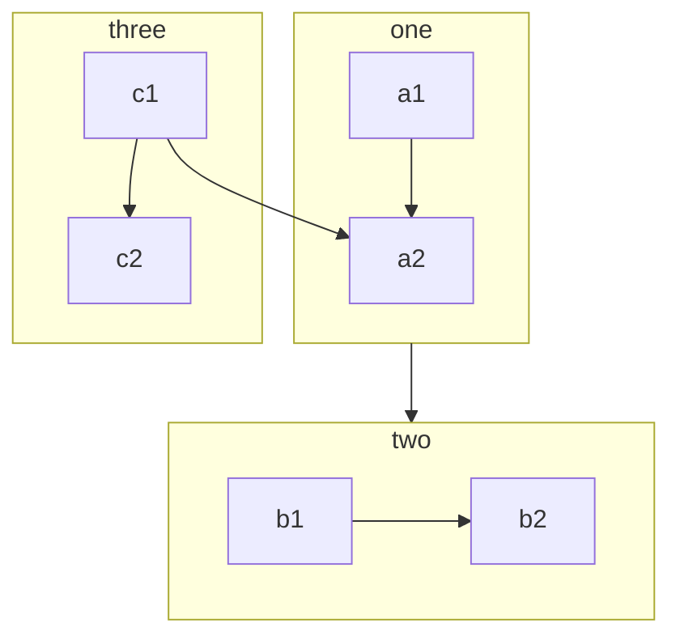
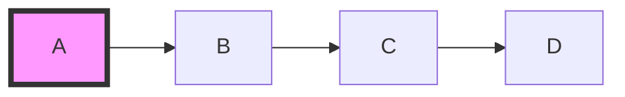
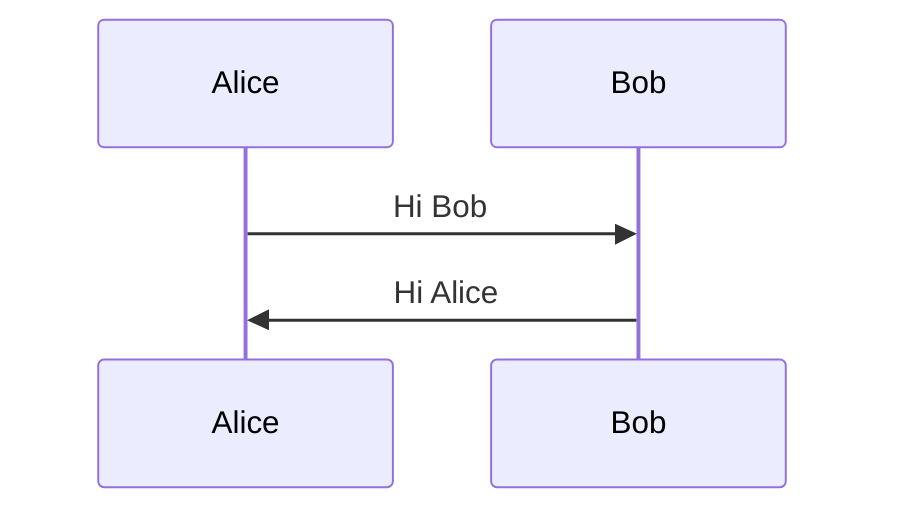
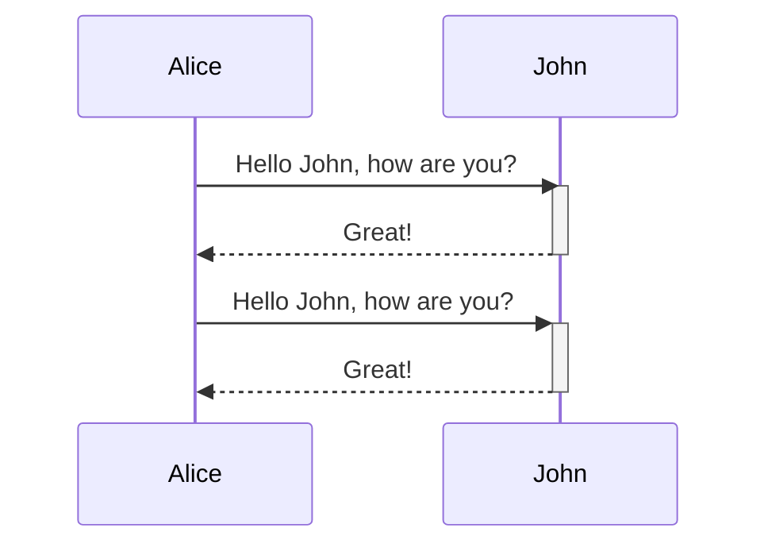

# Flowchart

```mermaid
flowchart BT
id1([1111])
id2[2222]
id3(3333)
id4((4444))
id5[[5555]]
id6>6666]
id7{7777}
id8{{8888}}
id9[/9999/]
id10[\10101010\]
id11[/11111111\]
id12[\12121212/]

```

```mermaid
flowchart LR
A-->B---C--A text oftest---D---|text too|E-->|text|F--text-->G-.->H-.text.->I==>J==text==>K
```

```mermaid
flowchart LR
a-->b & c-->d
A & B-->C & D
E o--o F <--> G x--x H
```

```mermaid
flowchart TD
A[start]-->B{is it?};
B-->|YES| C[Ok];
C-->D[Rethink];
D-->B;
B---->|NO| E[End];
```

```mermaid
flowchart LR
A["A double quote:#quot;"]-->B["A dec char :#9829;"]
```

```mermaid
flowchart TB
c1-->a2
subgraph one
a1-->a2
end
subgraph two
b1-->b2
end
subgraph three
c1-->c2
end
one-->two
```

```mermaid
flowchart LR;
    A-->B;
    B-->C;
    C-->D;
style A fill:#f9f,stroke:#333,stroke-width:4px
```

# Sequence Diagram

```mermaid
sequenceDiagram
participant Alice
participant Bob
Alice->>Bob: Hi Bob
Bob->>Alice: Hi Alice
```

```mermaid
sequenceDiagram
    Alice->>John: Hello John, how are you?
    activate John
    John-->>Alice: Great!
    deactivate John
    
    Alice->>+John: Hello John, how are you?
    John-->>-Alice: Great!
```

