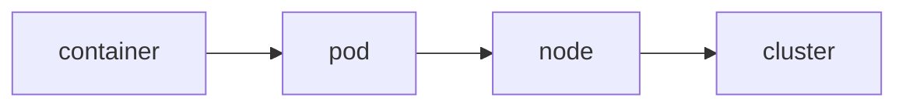

# k8s入门

## 了解k8s

来自google的borg

k8s中，**service**是分布式集群架构的核心。

其中：

- pod是k8s调度的最小单位
- pod是service的载体

## 术语

略

## 网络问题

三个IP

- node ip
- pod ip
- service ip

### 三种服务类型

- 无状态（大多数）
- 有状态（需配合operator使用）
- 批处理（job）

第一章可以说是TLDR，下章见吧。
