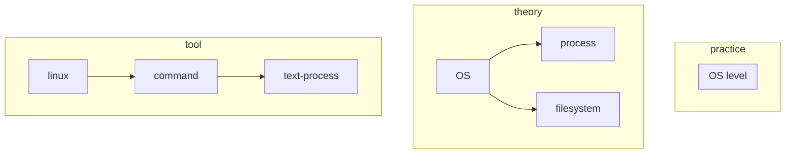

# Practice

## Linux

### tools

#### text

1. cat
2. more
3. less
4. sed
5. grep

#### internet

1. rsync
2. wget
3. curl

#### hardware

1. sysstat
2. iostat
3. fio
4. top

#### access

1. su
2. useradd
3. adduser
4. groupadd
5. groupdel
6. chmod
7. chown

# Dev

## Tools

### VCS

#### git

1. add
2. commit
3. clone
4. branch
5. checkout
6. merge
7. fetch
8. cherry-pick

#### svn

## Language

### C

1. semantic
2. pointer

### C++

1. OOP
2. generic

### GO

# Low

## OS

## Complier

## Network

### Application layer

### Transport layer

